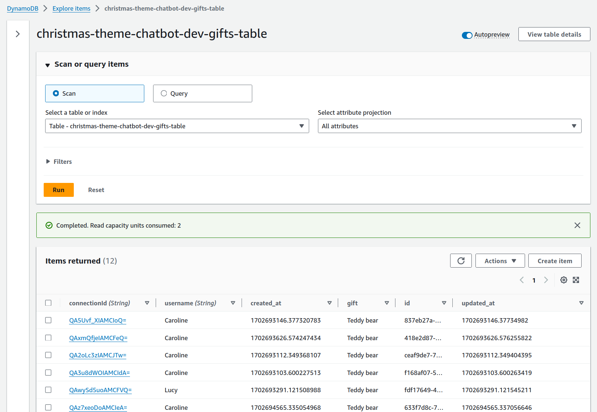

# Welcome to Christmas Theme Chatbot

This project was implemented as part of the [Serverless Holiday Hackathon](https://hackathon.serverless.guru/) organized by [Serverlesss Guru](https://serverlessguru.com/).
At this time the challenge was to implement a *Christmas Theme Chatbot* with the mandatory requeriment to use a *Large Language Model (LLM)* and preference *Serverless services*.


## Table of Contents

- [About the project](#about-the-project)
  - [Features](#features)
  - [Architecture Diagram](#architecture-diagram)
  - [Technologies](#technologies)
  - [Project Structure](#project-structure)
  - [Database Design](#database-design)
  - [Demo](#demo)
  - [Article](#article)

- [Development](#development)
  - [Local Setup](#local-setup)

- [Deployment](#deployment)
  - [Steps](#steps)

- [State of the Application](#state-of-the-application)
  - [MVP/PoC](#mvp/poc)
  - [Improments](#improvements)

## About the project

This application is a *Chatbot* which allow you to chat with *Santa Claus* about Christmas, Gifts and the Holiday in general. If the child says his name and the gift he would like to get, the system automatically detects the child name and the gift requested and stores into a gifts table, so Santa can check the gifts list to magically generate the gifts :).
At the `backend` it uses `AWS Bedrock` with the [Anthropic Claude V2](https://aws.amazon.com/es/bedrock/claude/) model to generate a `friendly dialog` about Christmas Theme.

### Features
- User Interface to Chat with Santa
- Bedrock invocation to generate a friendly conversation.
- Bedrock invocation to discover child name and gift requested.
- Able to store gift and child information into a database to helps Santa's to remember gifts by child.

### Architecture Diagram


### Technologies

#### Frontend
- Amplify Hosting
- React
- [UseWebSocket](https://www.npmjs.com/package/react-use-websocket)
- [React Chatbot Kit](https://fredrikoseberg.github.io/react-chatbot-kit-docs/)
- Docker

#### Backend
- SAM (Serverless Application Model)
- Lambda Function
- API Gateway Websocket
- SQS
- Dynamodb
- Bedrock (model id: anthropic.claude-v2)
- Docker
- Ruby 3.2
- Rake

### Project Structure

The project is built as *monorepo* just because the current state of the code represents a MVP. So it is split in two main folders: `frontend` and `backend`.

#### Frontend
The `src` folder contains the files to render the Chatbot Interface to chat with Santa.
Files:
- `App.js`: it's the main wrapper, it imports the `Chatbot` component provided by `react-chatbot-kit`.
- `MessageParser.js`: Handles the user messages and trigger the `action` to execute with the message.
- `ActionProvider.js`: Using the `react-use-websocket` library, it creates a websocket connection to the `serverless backend api` and sends the input message. It receives the api response and update the messages state to render in the UI Santa's chat.

#### Backend

The backend is a `sam` application which is structured as follow:
```
app/
  - functions: This folder contains the source code for all the lambdas functions
  - layers: This encapsulates the logic shared across multiple lambdas as a layer.
  - tasks: It contains `rake` tasks useful as helpers. Eg. To build the zip folder to upload as layer.

spec/
  - It contains unit tests associated to the `services` , `models` and `lambda handlers`

template.yaml: It contains all the resources definition to be deployed to AWS.

Gemfile: It contains all the gems the project requires to run successfully

Dockerfile: It contains a basic lambda based image to build and deploy the project to AWS
```

### Database Design

This project uses `Dynamodb` to store two major informations: `Connections` and `Gifts`.
In order to interact with the `db` it uses the gem [dynamoid](https://github.com/Dynamoid/dynamoid) which gives an active record model way to interact with the tables.

**Eg**
```
Connection.create(connectionId: 'abc')
Connection.find('abc')
```

These `tables` are modeled as follow




The tables are managed by `models`. The code can be found into `app/layers/shared/ruby/lib/models`

### Demo

If you want to try the Chatbot, use the next [link](https://main.d84kg9vv2z5z9.amplifyapp.com/)


### Article

https://dev.to/wildomonges/building-a-christmas-themed-chatbot-my-serverlessguru-hackathon-journey-3ojg

## Development

### Local Setup

#### Frontend

`Prerequisites`: Create a `.env` file into `frontend/chatbot/.env` with the following env variables:

```
REACT_APP_WEBSOCKET_ENDPOINT='wss://n6n7punoyj.execute-api.us-east-1.amazonaws.com/dev/'
REACT_APP_ACCESS_TOKEN=TOKEN
```
then using `docker` run the following `commands`

```bash
docker build -t chatbot-ui .
docker run --rm -it -v $PWD/chatbot:/chatbot chatbot-ui

npm install
npm run start

```
`Note` : The frontend application running locally is communicated with the `backend` application which runs on `AWS`.

##### Backend

`Prerequisites`: Create a `.env` file into `backend/.env` with the following env variables:

```
AWS_ACCESS_KEY_ID=
AWS_SECRET_ACCESS_KEY=
AWS_REGION=us-east-1
ACCESS_TOKEN=TOKEN
```
then using `docker` run the following `commands`

```bash
docker build -t chatbot .
docker run --rm -it -v $PWD:/chatbot

bundle install

# To execute rspec test
bundle exec rspec
```

## Deployment

### Steps

#### Frontend

The frontend is automatically deployed on pushing the code to `main` branch, this is because it uses the `CI/CD` provided
by `AWS Amplify`. 

#### Backend

`Note`: Unfortunately I have not configured yet a `CI/CD` pipeline for the backend, so to deploy the changes to `AWS` should be using `manual steps` as follow

Once logged into the `docker container`, run the following `commands` 

```
aws configure
bundle install
bundle exec rake chatbot:build_layer
sam validate -t template.yaml --lint
sam build
sam deploy --guided
```
Once deployed, you can `test` the websocket using `wscat` as follow

```
wscat -c wss://n6n7punoyj.execute-api.us-east-1.amazonaws.com/dev/
--connected

{ "action": "sendMessage", "data": "{\"message\": \"Hi Santa, I am Mike, I want a Picachu\", \"accessToken\": \"TOKEN\"}"}
```

`Note`: The `accessToken` is sent as part of the `sendMessage` action because I did not find an easy way to implement the `authorization` using `lambda request authorizer` or `api key` for websockets. 
 - `Using Lambda Request Authorizer`: I was able to setup the websocket to expect to receive the `Authorization` header,
 however from the Frontend, the library I use for websocket connection does not allow to set `headers`. So I discarded
 the `lambda request authorizer`
 - `Api Key`: I discarded this option because for `AWS::ApiGatewayV2::Api` the `ApiKey` and `Usage Plan` is not supported at this moment. 
So the current approach is just a `workaround` to provide some sort of security to the `backend api`

## State of the Application

### MVP/PoC

The current application is just a *Proof of Concept* to play with *AWS Bedrock* to see if is possible to build a *Christmas Theme Chatbot*, even if it's online [here](https://main.d84kg9vv2z5z9.amplifyapp.com/) It's far away to be on *production* 
mode to be shared with the public in general.

### Improvements

I would like to improve the Frontend application as well as the backend as follow

Frontend
- Provide a better UI/UX (for multi devices like mobile and tables)
- Add login page for Santa or Elf to be as an admin of the app
- Add page to allow santa to visualize the list of `gifts` grouped by `childs`

Backend
- Add better unit tests
- Add integration tests
- Add CICD with multi stages like `dev -> qa -> staging > prod`
- Improve the `prompt` used to `generate the conversation` as well as the one used for `gifts and child` discover.
- Improve the `log` format using `json` objects.
- Add `Bugsnag` or `Rollbar` to monitor `errors` in the application.
- Build monitoring dashboards to track informations like `Amount of Requests to the Chatbot`, `Gifts Most Requested`, etc.
- Add an incident management system like `PagerDutty`
- Add `Loading Testing`
- Provide a `Swagger` documentation about how to interact with the `Websocket api`
- Add a better `Authentication and Authorization` mechanism.
